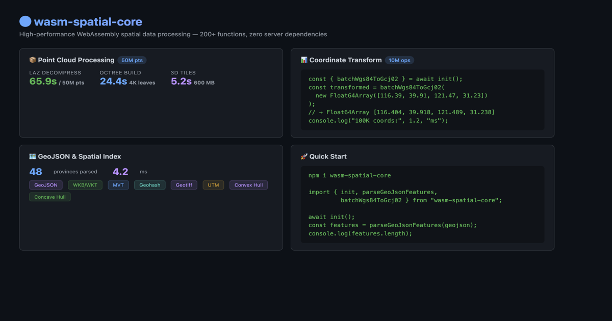

<div align="center">

# wasm-spatial-core

**Generate Cesium 3D Tiles in the browser.** Drag in a LAS / GeoTIFF / GLB,
get back a streaming `tileset.json` + pnts / quantized-mesh tiles — **no
server, no upload, no Cesium ion quota.** The data never leaves the user's
machine.

[](https://github.com/reed-soul/wasm-spatial-core/actions/workflows/ci.yml)
[](https://www.npmjs.com/package/wasm-spatial-core)
[](https://opensource.org/licenses/MIT)

-success)


<picture>
  <source media="(prefers-color-scheme: dark)" srcset="docs/demo.png">
  
</picture>

**[🌐 Live Demo](https://reed-soul.github.io/wasm-spatial-core/)** ·
[📦 npm](https://www.npmjs.com/package/wasm-spatial-core) ·
[📖 API Docs](https://reed-soul.github.io/wasm-spatial-core/docs/) ·
[📊 Head-to-head vs py3dtiles](./benchmarks/index.md) ·
[🗺️ Roadmap](./ROADMAP_V2.md)

**🧪 30-second try (drop a `.las` file, get a Cesium tileset):**

```html
<script type="module">
  import init, { parsePointCloudAuto, generateTileset }
    from 'https://esm.run/wasm-spatial-core';
  await init();

  // User drops a LAS file → parse → octree → 3D Tiles.
  // All in the browser. Bytes never touch a server.
  const cloud = parsePointCloudAuto(lasFileBytes);
  const tileset = generateTileset(cloud.positions(), 50000, 10);
  // → { tilesetJson, tiles: Uint8Array[], ... } — feed straight into Cesium.C3DTileset
</script>
```

</div>

---

## 👥 Adopters

Building something with wasm-spatial-core? Add your project here — open an
issue using the [feature request template](.github/ISSUE_TEMPLATE/feature_request.md)
or edit this section directly.

*(No production adopters listed yet — be the first. This section grows as the
project gets real-world use.)*

---

## Why does this exist?

If you've ever tried to view a customer's LAS scan in Cesium, you've hit one of:

- **Cesium ion** wants you to **upload their data** — GDPR / ITAR / NDA say no.
- **Desktop tools** (CloudCompare, Q2C) need install + per-machine license + manual steps.
- **Server-side pipelines** (PDAL, untwine) mean infra cost + a backend to maintain.
- **Just-plain-JS** parsers choke at 1M+ points (multi-second hangs).

`wasm-spatial-core` is a Rust → WebAssembly engine that does the whole
**LAS → octree → 3D Tiles** pipeline client-side. The output is byte-compatible
with what `Cesium.C3DTileset` consumes — so you can build a zero-backend,
zero-upload Cesium viewer that runs on a static host.

| | Cesium ion (SaaS) | Desktop tools | **wasm-spatial-core** |
|---|---|---|---|
| Customer data leaves the browser | ☁️ yes (uploaded) | 💻 no (local) | 💻 **no (local)** |
| Deployable on intranet / air-gap | ❌ | per-machine | ✅ static files |
| Per-GB / per-user cost | ✅ yes | license fee | ❌ free (MIT) |
| Works inside a web app | ✅ | ❌ | ✅ |
| Streams multi-GB scans | partial | n/a | ✅ COPC range fetch |

> **Not a PROJ / QGIS replacement.** CRS coverage is intentionally focused
> (WGS-84 / Web Mercator / UTM / China offsets). For arbitrary EPSG
> reprojection, pre-transform with PROJ and feed WGS-84 / ENU.

---

## ✨ Capabilities

**Core (the killer use case):**
- 🚀 **LAS / PLY / OBJ → 3D Tiles** (pnts) — octree partition + Draco optional
- 🏔️ **GeoTIFF → Quantized-Mesh Terrain** — Cesium `CesiumTerrainProvider`-compatible (proven by headless test, see W3.6 in `ROADMAP_V2.md`)
- 📡 **COPC range-fetch streaming** — multi-GB scans without loading the whole file

**Also in the box** (used internally, exposed as public APIs):
- 🗺️ Coordinate transforms: WGS-84 ↔ GCJ-02 / BD-09 / Web Mercator / UTM (~30–250× faster than JS equivalents — see [PERFORMANCE.md](./PERFORMANCE.md))
- 🧊 Spatial IR + mesh edit: GLB ingest, OBB split, plane clip, QEM decimation
- ⚡ WebGPU compute kernels (with WASM fallback)
- 🔒 **Zero server, zero upload, zero runtime dependencies**

`npm install wasm-spatial-core` ships a prebuilt 1.2 MB WASM binary — no
native deps, no postinstall, works on any static host (GitHub Pages, S3,
nginx, even `python -m http.server`).

---

## 🌐 See it work

Live, drag-and-drop, no backend:

| Demo | What it shows |
|------|--------------|
| **[Cesium 3D Tiles](https://reed-soul.github.io/wasm-spatial-core/examples/point-cloud-cesium/)** | Drop a `.las` / `.tif` / `.glb` → octree → 3D Tiles → Cesium globe. **The killer demo.** |
| **[COPC streaming](https://reed-soul.github.io/wasm-spatial-core/examples/cesium-workflow/)** | Range-fetch a multi-GB `.copc` scan byte-range by byte-range (no full download). |
| **[Terrain viewer](https://reed-soul.github.io/wasm-spatial-core/examples/terrain-demo/)** | GeoTIFF → quantized-mesh, with cut / flatten / fill edits. |
| **[Demo hub](https://reed-soul.github.io/wasm-spatial-core/examples/)** | All examples + benchmarks. |

Run any of them locally with `npm run demo`.

---

## 🚀 Quick Start: LAS → Cesium in 20 lines

```bash
npm install wasm-spatial-core
```

```js
import init, { parsePointCloudAuto, generateTileset } from 'wasm-spatial-core';
// Cesium loaded separately (CDN or npm) — we only emit the tile bytes.
await init();

// 1. User drops a .las file. Parse it.
const cloud = parsePointCloudAuto(lasFileBytes);
// cloud.positions() → Float32Array [x,y,z, ...]

// 2. Build octree → 3D Tiles (pnts + tileset.json).
const tileset = generateTileset(cloud.positions(), 50000 /* max pts/node */, 10 /* depth */);
// tileset.tilesetJson() → string
// tileset.tile(i)      → Uint8Array (one pnts blob per tile)

// 3. Hand the tiles to Cesium via blob URLs (no server needed).
const json = JSON.parse(tileset.tilesetJson());
for (let i = 0; i < tileset.tileCount; i++) {
  const url = URL.createObjectURL(new Blob([tileset.tile(i)]));
  json.root.content.uri = json.root.content.uri.replace(`tile_${i}.pnts`, url);
  // (in practice, walk the tree and rewrite each leaf's content.uri)
}
const cesiumTileset = await Cesium.C3DTileset.fromUrl(
  URL.createObjectURL(new Blob([JSON.stringify(json)], { type: 'application/json' })),
);
viewer.scene.primitives.add(cesiumTileset);
```

That's the whole story — no backend, no upload, no ion token. For a working
drag-and-drop demo, see the **[Point Cloud + Cesium example](https://reed-soul.github.io/wasm-spatial-core/examples/point-cloud-cesium/)**.

<details>
<summary><b>Optional: Draco compression (~5× smaller tiles)</b></summary>

```bash
npm install draco3d
```

```js
import { compressTilesetWithDraco } from 'wasm-spatial-core';
import { createEncoderModule } from 'draco3d';

const encoder = await createEncoderModule({});
const compressed = compressTilesetWithDraco(tileset, encoder, { quantizationBits: 11 });
// Typical ratio: ~20% of original size, position-color pairing preserved.
```

</details>

### What's in the npm package?

`npm install wasm-spatial-core` ships a **prebuilt WASM binary** compiled with
`point-cloud` + `geotiff` + `laz-support` + `mesh-ingest`, plus both the
browser (web) and Node.js targets. That gives you:

| Included in npm | Not in npm (custom `wasm-pack` build) |
|-----------------|---------------------------------------|
| LAS / LAZ / COPC parsing | E57 (`e57-support`) |
| Octree + 3D Tiles (pnts) | Terrain deformation (`terrain-edit`) |
| GeoTIFF → quantized-mesh terrain | Mesh QEM / clip / OBB split (`mesh-edit`, needs `mesh-ingest`) |
| Spatial IR + GLB ingest | WebGPU compute kernels (`webgpu`) |
| Coordinates, GeoJSON, MVT, spatial analysis | Multi-thread build (COOP/COEP, see GitHub Releases) |

**Format counts:** **12+** read/write paths in the default npm build (LAS/LAZ/COPC, PLY, OBJ, PCD, GeoJSON, MVT, WKT/WKB, GeoTIFF, GPX, TopoJSON, 3D Tiles/glTF output, …). **15+** when optional format features are enabled (E57, GLB ingest, …).

Runtime checks: `supportsLaz()`, `supportsGeotiff()`, `lazStatus()`.

Upgrading from 0.9? See **[docs/MIGRATION_V0_10.md](docs/MIGRATION_V0_10.md)** — the batch UTM APIs now carry the hemisphere explicitly, and southern-hemisphere conversions from ≤ 0.9 were wrong by ~10,000 km.

CI runs **`cargo test --all-features`** — **857 tests pass** (plus 34 `#[ignore]`d performance benchmarks) across the full feature matrix. The live count is printed by CI on every run; see the latest `rust` job log for the current number.

---

## 🎯 Core Pipelines

### Point Cloud → 3D Tiles

```
LAS / PLY / OBJ  (npm default)
LAZ / COPC / E57 (optional build features — see table above)
        │
        ▼
  ┌──────────────┐
  │ WASM Parser   │  Browser-side; format set depends on build features
  └──────┬───────┘
         ▼
  ┌──────────────┐
  │ Octree Build  │  8-way spatial partitioning
  └──────┬───────┘
         ▼
  ┌──────────────┐
  │ pnts Encoder  │  3D Tiles Point Cloud binary
  └──────┬───────┘
         ▼
  ┌──────────────┐     ┌──────────────┐
  │ tileset.json  │     │ Draco Compress │  Optional (~20% ratio)
  └──────┬───────┘     └──────┬───────┘
         │                      │
         ▼                      ▼
  Cesium / Three.js — interactive 3D
```

### GeoTIFF → Terrain Tiles

```
GeoTIFF (.tif)
        │
        ▼
  ┌──────────────┐
  │ WASM Parser   │  Float32/16/8, strip/tile, DEFLATE
  └──────┬───────┘
         ▼
  ┌──────────────┐
  │ Quantized-Mesh │  Cesium terrain binary format
  └──────┬───────┘
         ▼
  ┌──────────────┐
  │ tileset.json   │  LOD pyramid (zoom 0..N)
  └───────────────┘
```

---

## ⚡ Performance

The whole reason this exists: do in-browser what previously needed a server.
On **Apple M2**, single-thread WASM (no WebGPU):

| Dataset | Points | Parse | Octree + Tileset | Total |
|---------|--------|-------|------------------|-------|
| sample.las | 1K | — | < 1 ms | — |
| Synthetic | 500K | 36 ms | 166 ms | **205 ms** |
| Synthetic | 10M | 1.1 s | 3.6 s | **4.8 s** |
| **Synthetic** | **100M** | **0.4 s** | **6.8 s** | **8.5 s** |

> 100M-point number is native release (Rust); WASM is ~1.5× slower but still
> well under 30 seconds. Compare: potree (JS) takes ~3 s just for octree at 1M.

**Coordinate conversion** (the same engine, different workload):

| Operation | Pure JS | WASM | Speedup |
|-----------|---------|------|---------|
| WGS84 → GCJ-02 | ~1,200 ms | ~45 ms | **~27×** |
| WGS84 → Mercator | ~800 ms | ~12 ms | **~67×** |

See [PERFORMANCE.md](./PERFORMANCE.md) for full methodology + comparison with
potree / three.js Octree / las-js.

---

## 📦 Format Support

### Point Cloud

| Format | Read | Feature Flag |
|--------|------|-------------|
| LAS (1.2–1.4, Format 0–6) | ✅ | `point-cloud` |
| LAZ (compressed) | ✅ | `laz-support` |
| COPC (Cloud Optimized) | ✅ | `laz-support` |
| PLY (ASCII + binary) | ✅ | `point-cloud` |
| OBJ | ✅ | `point-cloud` |
| PCD (ASCII + binary) | ✅ | `point-cloud` |
| E57 | ✅ | `e57-support` |

### Vector & Geometry

| Format | Read | Write |
|--------|------|-------|
| GeoJSON | ✅ | ✅ |
| MVT (Vector Tiles) | ✅ | ✅ |
| WKT / WKB | ✅ | ✅ |
| GeoTIFF (Terrain) | ✅ | — |
| glTF 2.0 / GLB | — | ✅ |
| 3D Tiles (pnts) | — | ✅ |
| 3D Tiles (b3dm) | — | ✅ |
| 3D Tiles (quantized-mesh) | — | ✅ |

### Coordinate Systems

| System | Direction |
|--------|-----------|
| WGS-84 ↔ GCJ-02 / BD-09 | ✅ |
| WGS-84 ↔ Web Mercator (EPSG:3857) | ✅ |
| WGS-84 ↔ CGCS2000 | ✅ |
| WGS-84 ↔ UTM | ✅ |

### Spatial Analysis

R-Tree / Octree indexing, bounding box / KNN queries, haversine / vincenty distance, polygon boolean ops, Douglas-Peucker simplification, convex / concave hull, DBSCAN / grid clustering, TIN interpolation, and more.

---

## 📖 API Reference

### Point Cloud → 3D Tiles

```typescript
import { loadSpatialCore } from 'wasm-spatial-core';
const wasm = await loadSpatialCore();

// Auto-detect format
const cloud = wasm.parsePointCloudAuto(bytes);
console.log(cloud.count());        // point count
console.log(cloud.positions());    // Float32Array [x,y,z,...]
console.log(cloud.colors());       // Uint8Array [r,g,b,...] | null

// Octree
const octree = wasm.buildOctree(cloud.positions(), 50000, 10);
console.log(octree.nodeCount());   // node count
console.log(octree.depth());       // tree depth

// 3D Tiles tileset
const tileset = wasm.generateTileset(cloud.positions(), 50000, 10);
console.log(tileset.tileCount());  // tile count
console.log(tileset.tilesetJson()); // tileset.json string
```

### Draco Compression

```typescript
import { compressTilesetWithDraco, buildDracoTileset } from 'wasm-spatial-core';
import { createEncoderModule } from 'draco3d';

const encoderModule = await createEncoderModule({});

// Compress all tiles
const results = compressTilesetWithDraco(tileset, encoderModule, {
  quantizationBits: 11,   // 8–18, default 11
  encodeSpeed: 5,         // 0–10, default 5
  decodeSpeed: 5,         // 0–10, default 5
  compressColors: false,  // also compress RGB (default false)
});

// Or build a complete compressed tileset
const { tiles, totalCompressedSize, compressionRatio } =
  buildDracoTileset(tileset, encoderModule);
```

### Coordinate Conversion

```typescript
const coords = new Float64Array([116.404, 39.915, 121.474, 31.230]);
const gcj02 = wasm.batchWgs84ToGcj02(coords);       // batch transform
wasm.batchWgs84ToGcj02InPlace(mutable);             // zero-copy in-place
const [zone, easting, northing] = wasm.wgs84ToUtm(116.404, 39.915);
```

### GeoJSON

```typescript
// Chunked output: parses the full JSON first, then emits coordinate batches
// (progress callbacks + lower peak coord memory — not byte-stream input).
wasm.parseGeoJsonStream(hugeGeojson, 500, (chunk, processed, total) => { /* ... */ });

// Lower memory per iteration: one feature at a time (input string still required)
const iter = wasm.parseGeoJsonLazy(hugeGeojson);
```

**[📖 Full API Docs](https://reed-soul.github.io/wasm-spatial-core/docs/)**

---

## 🛠️ Build from Source

```bash
git clone https://github.com/reed-soul/wasm-spatial-core.git
cd wasm-spatial-core

# Point cloud + GeoTIFF
wasm-pack build --target web --release --out-dir pkg -- --features point-cloud,geotiff

# Run demos
npm run demo
```

### Feature Flags

| Feature | In npm | Default crate | Description |
|---------|--------|---------------|-------------|
| `single-thread` | ✅ | ✅ | Zero-config, works everywhere |
| `point-cloud` | ✅ | ❌ | LAS/PLY/OBJ/PCD + octree + 3D Tiles |
| `geotiff` | ✅ | ❌ | GeoTIFF terrain + quantized-mesh |
| `multi-thread` | ❌ | ❌ | Web Workers + SharedArrayBuffer |
| `laz-support` | ❌ | ❌ | LAZ/COPC decompression (+ ~400 KB WASM) |
| `e57-support` | ❌ | ❌ | E57 format |
| `terrain-edit` | ❌ | ❌ | Heightfield flatten/deform (requires `geotiff`) |
| `mesh-ingest` | ❌ | ❌ | Spatial IR + GLB ingest (Wave 2) |
| `mesh-edit` | ❌ | ❌ | Mesh QEM / OBB split (requires `mesh-ingest`) |
| `draco-support` | ❌ | ❌ | Draco compression API (JS-side via draco3d) |

---

## 📋 Roadmap

| Doc | Scope |
|-----|-------|
| **[VISION.md](./VISION.md)** | Product vision — Web3D spatial **compute engine** (core only) |
| **[ROADMAP_V2.md](./ROADMAP_V2.md)** | Active plan — Waves 1–5 (runtime, IR, terrain, GPU, mesh edit) |
| **[docs/ENGINE_BOUNDARY.md](./docs/ENGINE_BOUNDARY.md)** | What is **in** the engine vs your application |
| **[ROADMAP_V1.md](./ROADMAP_V1.md)** | ✅ Completed — point cloud → 3D Tiles browser pipeline |

**V1 highlights (done):** LAS → octree → 3D Tiles (npm) · LAZ/COPC/E57 (optional builds) · GeoTIFF terrain · Draco · multi-thread WASM · Node.js batch API

**V2 next:** spatial IR · terrain/mesh edit (source available; not in default npm) · WebGPU · incremental tiles — see [issue templates](./docs/issues/) (start at **W2**)

---

## 🤝 Contributing

See [**CONTRIBUTING.md**](./CONTRIBUTING.md).

- 🐛 [Report a bug](.github/ISSUE_TEMPLATE/bug_report.md)
- 💡 [Request a feature](.github/ISSUE_TEMPLATE/feature_request.md)

---

## 📄 License

[MIT License](./LICENSE) — © 2026 Zhiqi Weilai

---

<div align="center">

**Built with 🦀 Rust + 🕸️ WebAssembly**

*Native spatial computing in every browser.*

</div>
