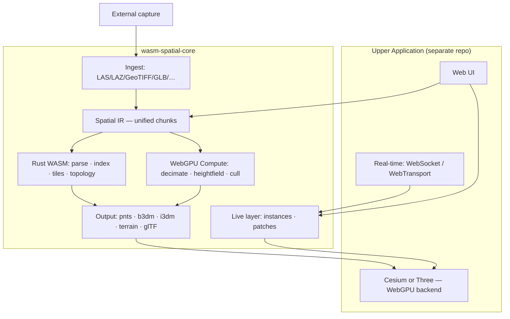

# wasm-spatial-core — Product Vision

> **One-liner:** A next-generation **Web3D spatial compute engine** for the latest Chrome — WASM for correctness and orchestration, WebGPU for throughput, 3D Tiles for distribution. Upper applications should replace most of the A/B/C/D desktop toolchain **before** rendering.

---

## 1. What We Are Building

### 1.1 The Problem

Building a Web3D scene today (park twin, campus ops, home visualization, inspection replay) typically requires:

- Tool A — capture / reconstruction
- Tool B — mesh cleanup
- Tool C — terrain / point cloud processing
- Tool D — coordinate / GIS
- Tool E — compression & tiling
- Tool F — upload to a cloud tile service

Each tool owns a slice of the pipeline. Data is exported, re-imported, and re-tiled repeatedly. Privacy, latency, and iteration speed all suffer.

### 1.2 The Goal

**wasm-spatial-core** is the **browser-native spatial engine** that absorbs the heavy pre-processing:

```
External capture (optional)  →  Engine (this repo)  →  3D Tiles / glTF  →  Cesium / Three
                                      ↑
                         Upper app: UI, IoT, business rules
```

The **upper application** (your future project) should be ~80% engine APIs + viewer + real-time bindings — not a chain of desktop apps.

### 1.3 Non-Goals (Stay Out of the Engine)

| Belongs in the **application layer** | Belongs in **wasm-spatial-core** |
|--------------------------------------|----------------------------------|
| Park/campus business UI | Format parsing & spatial algorithms |
| MQTT / parking / charging integrations | Instance slots, pose updates, tile patches |
| Inspection paths, geofencing, trajectory replay | — (use viewer + app code) |
| Auth, multi-tenant, dashboards | Mesh/terrain edit kernels |
| “Demolish toilet → build playground” **workflow** | Clip / flatten / export **primitives** |

---

## 2. Target Platform Assumptions

We optimize for **the latest Chrome** only. No legacy browser matrix.

| Assumption | Rationale |
|------------|-----------|
| Chrome ≥ 140 (moving target: always **current stable**) | WebGPU compute, subgroups, fast buffer uploads |
| `crossOriginIsolated` when multi-thread WASM is needed | SharedArrayBuffer + Rayon |
| WebGPU for parallel geometry | QEM, heightfield ops, massive point ops |
| WASM SIMD + multi-thread features | Coordinate batches, octree, tile encode |
| 3D Tiles as primary **distribution** format | Cesium ecosystem, LOD, streaming |

Safari/Firefox compatibility is **not** a release blocker.

---

## 3. Architecture (Target State)



### Compute split

| Layer | Responsibility |
|-------|----------------|
| **Rust / WASM** | Formats, spatial index, tile trees, topology, orchestration, deterministic correctness |
| **WebGPU compute** | Throughput-bound work: mesh decimation, heightfield deform, large point transforms, frustum cull |
| **JavaScript** | Viewer glue, I/O, scheduling, `AbortSignal`, progress UI |

Do **not** run million-triangle QEM purely on a single WASM thread.

---

## 4. Capability Stack & Gap Summary

See **[ROADMAP_V2.md](./ROADMAP_V2.md)** for wave-by-wave execution and GitHub issue templates.

| Layer | Role | Status (v0.7.x) | Gap |
|-------|------|-----------------|-----|
| **L0** Runtime | Zero-copy, threads, memory budget, cancellable jobs | Partial | Arena model, job cancellation, large-scene budgeting |
| **L1** CRS | Projections, local ENU, registration | Strong | ENU / tangent plane, SVD 3-point alignment, NTv2 grids |
| **L2** Ingest | Unified import | Strong for point cloud + terrain | **GLB read/edit**, 3DGS strategy, production IFC |
| **L3** Index | Query, LOD, incremental updates | Strong | Dynamic index updates, GPU BVH |
| **L4** Geometry CPU | Clip, flatten, boolean, decimate | Weak | **Mesh clip, terrain deform, QEM** |
| **L5** GPU | WebGPU compute kernels | **Missing** | **Strategic gap** |
| **L6** Output | 3D Tiles, glTF, streaming | Strong | Incremental tile patches, hot reload protocol |
| **L7** Live | Instance slots, visibility, tile patches | Partial | In-place instance updates, incremental tile patch protocol |
| **L8** DX | Pipeline API, benchmarks, errors | Partial | Composable pipeline, perf gates per module |

### The five critical gaps (executive summary)

1. **Spatial IR** — one internal representation for point clouds, meshes, heightfields, instance groups  
2. **Geometry edit kernel** — terrain flatten / cut / fill + mesh clip & simplify  
3. **WebGPU compute layer** — otherwise “top-tier performance” is not credible  
4. **Scene instance layer** — slot-based instances, occupancy/visibility, tile patches (not one-shot tilesets)  
5. **Pipeline engineering** — cancellable jobs, memory estimates, benchmark gates  

---

## 5. Relationship to ROADMAP_V1

| Document | Scope |
|----------|-------|
| **[ROADMAP_V1.md](./ROADMAP_V1.md)** | ✅ Completed campaign: point cloud → 3D Tiles in the browser |
| **[ROADMAP_V2.md](./ROADMAP_V2.md)** | 🔜 Next: unified Web3D spatial engine (this vision) |
| **[PLAN.md](./PLAN.md)** | Historical module checklist |

V1 proved the wedge (**zero-upload point clouds**). V2 generalizes the engine for **edit + live sync + GPU**.

---

## 6. 3D Gaussian Splatting (3DGS)

3DGS is an **input strategy**, not a Day-1 engine core.

| Phase | Approach |
|-------|----------|
| Near-term | External reconstruction → engine ingests mesh or point cloud |
| Mid-term | Web viewer integration or splat → mesh/point conversion |
| Long-term | WebGPU splat clip/merge (research; optional module) |

Scene **modification** (flatten, cut, replace) should prefer **heightfield + mesh** layers over direct splat editing.

---

## 7. Quality Bar

Every new capability must meet:

- **Performance** — benchmark vs pure JS or naive WASM; regression CI gate  
- **Stability** — no panics across WASM boundary; `SpatialError` at API edge  
- **Efficiency** — reuse buffers; avoid allocations in hot loops  
- **Zero-copy** — `Float32Array` / `Float64Array` in the hot path  
- **Feature-gated** — optional modules (`mesh-edit`, `webgpu`, …) keep default WASM small  

---

## 8. Success Criteria (Engine-Level)

The vision is achieved when a developer can:

1. Import park/home assets **in the browser** (point cloud, terrain, GLB)  
2. **Edit** the scene (select region, flatten terrain, clip mesh, hide/export) without Blender  
3. **Emit** 3D Tiles or glTF and load in Cesium/Three  
4. **Bind** live data (slot occupancy, instance poses) with in-place updates  
5. Do all of the above in **one npm package**, on **latest Chrome**, with measured perf  

---

## 9. Contributing to the Vision

- Read **[ROADMAP_V2.md](./ROADMAP_V2.md)** for wave priorities  
- File issues using templates in **[docs/issues/](./docs/issues/)**  
- Keep engine APIs **UI-free** and **scenario-free**  

---

*© 2026 Zhiqi Weilai — MIT License*
