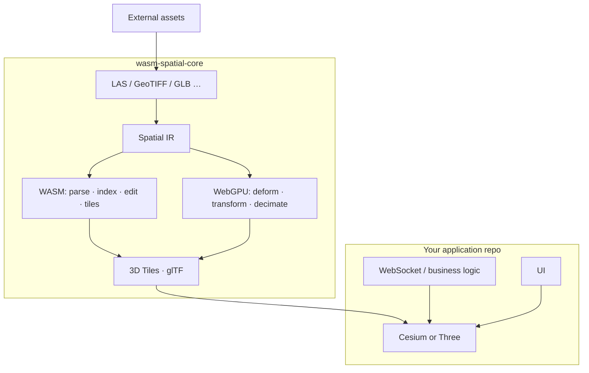

# wasm-spatial-core — Product Vision

> **One-liner:** A **Web3D spatial compute engine** for the latest Chrome — ingest, edit geometry, emit 3D Tiles / glTF in the browser. **Core only**; product UIs and IoT live in your application repo.

**Boundary doc:** [docs/ENGINE_BOUNDARY.md](./docs/ENGINE_BOUNDARY.md)

---

## 1. What We Are Building

### 1.1 The Problem

A Web3D scene today often needs many desktop tools — each owns one step (mesh cleanup, terrain, CRS, tiling, upload). Data is exported and re-imported repeatedly.

### 1.2 The Goal

```
External capture (optional)  →  Engine (this repo)  →  3D Tiles / glTF  →  Cesium / Three
                                      ↑
                         Your app: UI, real-time data, business rules
```

**wasm-spatial-core** absorbs **spatial pre-processing** so your next project is mostly engine calls + a viewer — not Blender × QGIS × PDAL × ion.

### 1.3 Non-Goals

See [ENGINE_BOUNDARY.md](./docs/ENGINE_BOUNDARY.md). In short:

- No parking / charging / inspection **product** APIs  
- No MQTT, geofence, trajectory replay, scene timelines  
- No viewer concerns (frustum cull, polyline animation)  
- No “workflow wizards” (demolish toilet → playground is **your app**; clip/flatten **primitives** are engine)

---

## 2. Platform

Latest **Chrome stable** only. WebGPU compute, WASM threads + SIMD, SharedArrayBuffer when needed. 3D Tiles as primary distribution format.

---

## 3. Architecture



| Layer | Responsibility |
|-------|----------------|
| **WASM** | Formats, IR, geometry edit, tile trees, correctness |
| **WebGPU** | Throughput-bound geometry (not viewer culling) |
| **JS** | Init, Workers, `AbortSignal`, progress |

---

## 4. Capability Gaps (v0.7 → core complete)

| Layer | Gap |
|-------|-----|
| **L0 Runtime** | Tile patch, job cancel, buffer arena |
| **L1 CRS** | ENU local frame (site-scale precision) |
| **L2 Ingest** | **Spatial IR**, **GLB read**, region select |
| **L4 Geometry** | **Terrain deform**, **mesh clip**, **QEM** |
| **L5 GPU** | **WebGPU compute module** |
| **L6 Output** | Incremental patch protocol |

**Not core gaps:** live twins, trajectories, GPU BVH, NTv2 grids, 3DGS pipeline, SVD registration (backlog).

### Five priorities

1. **Spatial IR** (W2)  
2. **Geometry edit** — terrain + mesh (W3, W5)  
3. **WebGPU throughput** (W4)  
4. **Incremental tiles + cancellable jobs** (W1)  
5. **Benchmarks + `SpatialError` on every new API**  

---

## 5. Roadmaps

| Doc | Scope |
|-----|-------|
| [ROADMAP_V1.md](./ROADMAP_V1.md) | ✅ Point cloud → 3D Tiles |
| [ROADMAP_V2.md](./ROADMAP_V2.md) | 🔜 Core engine waves W1–W5 |
| [PLAN.md](./PLAN.md) | Historical checklist + backlog |

**Default implementation order:** W2 → W3/W5 (geometry) → W4 (GPU) → W1 (runtime hardening in parallel when needed).

---

## 6. 3D Gaussian Splatting

Input strategy only — **not core**. Ingest mesh or point cloud from external 3DGS tools; edit via heightfield + mesh layers.

---

## 7. Quality Bar

Performance benchmarks · zero-copy typed arrays · no WASM panics · feature flags keep default binary small.

---

## 8. Success Criteria

A developer on latest Chrome can:

1. Import assets in-browser (point cloud, terrain, GLB)  
2. Edit geometry (select, flatten terrain, clip/simplify mesh) without desktop GIS/DCC tools  
3. Export 3D Tiles or glTF and load in Cesium/Three  
4. Apply **incremental tile patches** after edits without full rebuild  
5. Measure perf via included benchmarks  

Real-time business data (parking, chargers, drones) is **composed in the application** using the viewer + existing exports (`i3dm`, etc.) — not via engine “twin plugins.”

---

*© 2026 Zhiqi Weilai — MIT License*
